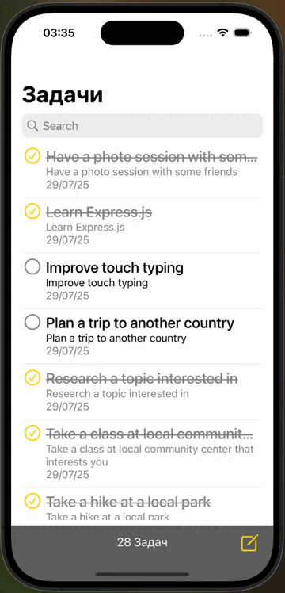
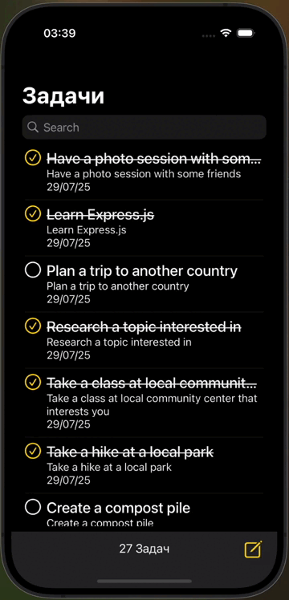

# ToDoListTest

ToDoListTest — это простое мобильное приложение для управления задачами, созданное с использованием SwiftUI и CoreData. Проект реализован в рамках тестового задания на вакансию iOS разработчика.

## 🚀 Функциональность

- Создание задач  
- Редактирование задач  
- Удаление задач  
- Поиск по задачам  
- Возможность делиться задачей через стандартное системное меню
- Загрузка данных из API при первом запуске приложения

## 🌍 Локализация

Приложение поддерживает два языка:
- 🇷🇺 Русский  
- 🇬🇧 Английский

## 🧱 Технологии

- Swift  
- SwiftUI  
- CoreData  
- MVVM-архитектура  
- Unit Testing

## 🌐 Работа с API

При первом запуске приложения происходит однократная загрузка задач из внешнего API. После этого данные хранятся локально с использованием CoreData.

## 🌗 Темы

Приложение поддерживает светлую и тёмную темы интерфейса.

| Light Mode | Dark Mode |
|------------|-----------|
|  |  |

## 📱 Интерфейс

Приложение содержит:
- Экран со списком задач
- Экран создания/редактирования задачи
- Контекстное меню (ContextMenu) для удобных действий с задачей

## 🛠 Установка и запуск

1. Клонируйте репозиторий:
   ```bash
   git clone https://github.com/your-username/ToDoListTest.git
    ```

2. Откройте проект в Xcode (версии **15.2** или новее)
3. Убедитесь, что в настройках проекта установлена минимальная версия iOS — **18.2**
4. Соберите и запустите проект на симуляторе или устройстве

## 🧪 Тестирование

В проекте реализованы базовые тесты для проверки корректной работы основных функций.

## 📌 Статус проекта

Проект завершён. Используется как демонстрация навыков при отклике на вакансию.

